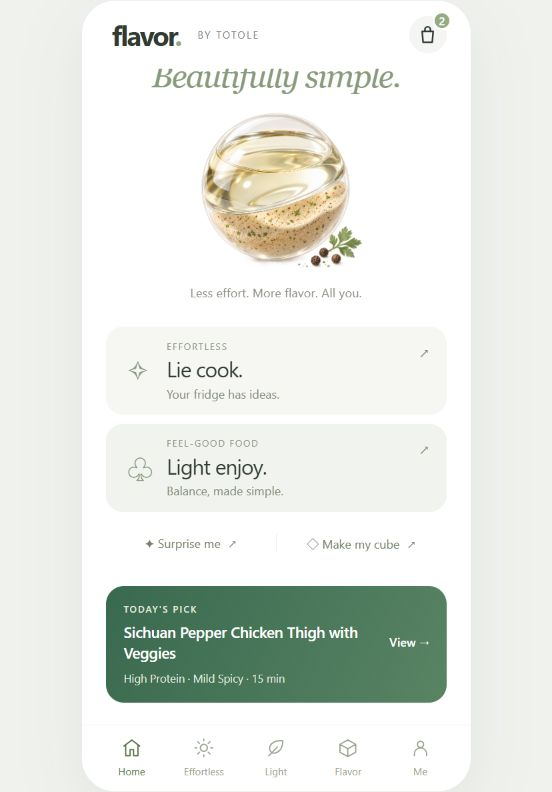

# Flavor Pod · ONE POD. SOLVES IT.

面向 Z 世代的轻烹饪概念：以一颗风味胶囊连接食材、食谱与个人口味，让日常做饭更简单。

**[在线体验 · Live Demo →](https://jessiii-mo.github.io/flavor-pod/)**

<p align="center"></p>

## 项目背景

围绕太太乐「轻烹饪 · 即刻美味」比赛主题，本方案面向 18–28 岁年轻消费者，回应「不会做、不想做、想吃得更均衡」的日常需求。产品设想由双腔风味胶囊、数字食谱体验与可自由组合的 Flavor Cube 组成。

本仓库呈现其中的移动端网页交互原型。设计以统一白底、柔和绿色、细线图标和轻量卡片组织信息；首页保留透明双腔调料球的产品特征，连接轻烹饪、周计划与个性化风味探索。

## 核心体验

| 页面 | 当前可体验内容 |
| --- | --- |
| **Home** | 品牌首页、功能入口与今日推荐 |
| **Effortless** | 分类选择食材、按本地匹配规则推荐食谱、查看做法、收藏与演示加购 |
| **Light** | 四种目标切换、宏量比例切换、日期选择与示例餐单 |
| **Flavor · Shaker** | MBTI / Taste / Vibe 三列摇动动画、随机食谱探索与详情 |
| **Flavor · Cube** | 27 格立体收纳盒、旋转、分层编辑、食材图标选项、拖拽交换与本地保存 |
| **Me** | 查看已保存食谱、魔方和演示订单；地址、偏好及语言入口为展示状态 |

## 原型说明

- 这是比赛及个人作品集概念，并非雀巢或太太乐官方线上服务。
- 食谱推荐采用浏览器内的示例数据和规则，未接入真实 AI、生鲜平台或支付接口。
- 周计划与营养数值为演示内容；结算仅生成本地演示记录，不产生交易。
- 购物车、收藏、魔方和演示订单保存在当前浏览器的 `localStorage`，不跨设备同步。
- Cube 分享按钮分享的是页面入口；比赛资料中的商业测算、供应链和 API 集成属于方案设想，并非本原型已实现的经营成果。

## 技术与运行

原生 HTML、CSS、JavaScript，零前端构建依赖。移动端优先，桌面呈现手机画框，使用哈希路径切换页面。

```bash
python -m http.server 8000
```

打开 `http://localhost:8000/`。线上版本使用 GitHub Pages 托管仓库根目录。

```text
index.html     页面结构
css/           基础样式与视觉细化
js/app.js      交互、示例数据与本地存储
assets/        产品视觉与界面预览
docs/          比赛资料与简历二维码
```

<details>
<summary>比赛方案资料 · Project documents</summary>

- [项目简介 · PDF / 2 页](docs/project-brief.pdf)
- [方案演示文稿 · PDF / 15 页](docs/presentation.pdf)

文件保留原始比赛方案内容，完整展示产品、用户洞察与商业构想。产品视觉使用 AI 辅助生成，详情见项目简介中的说明。

</details>
